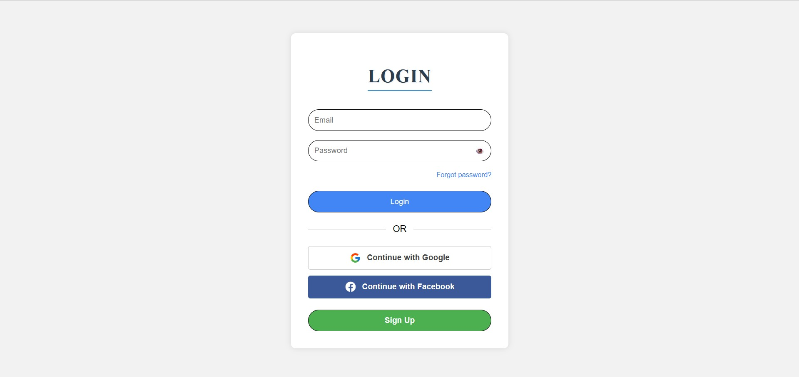
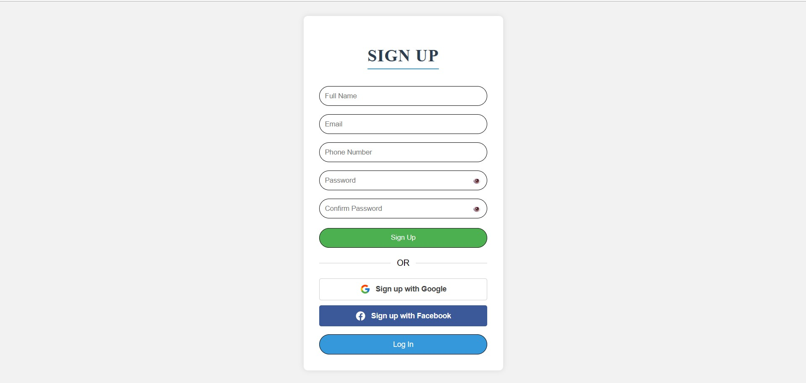
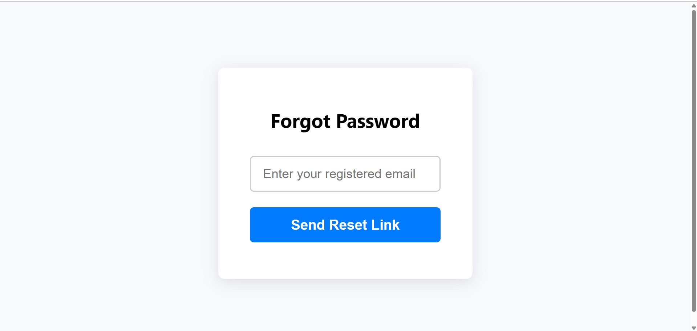
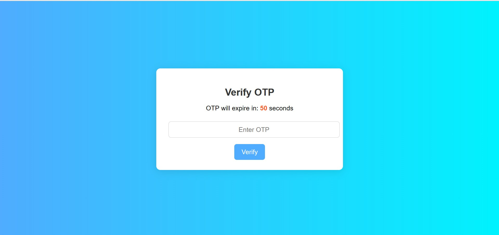
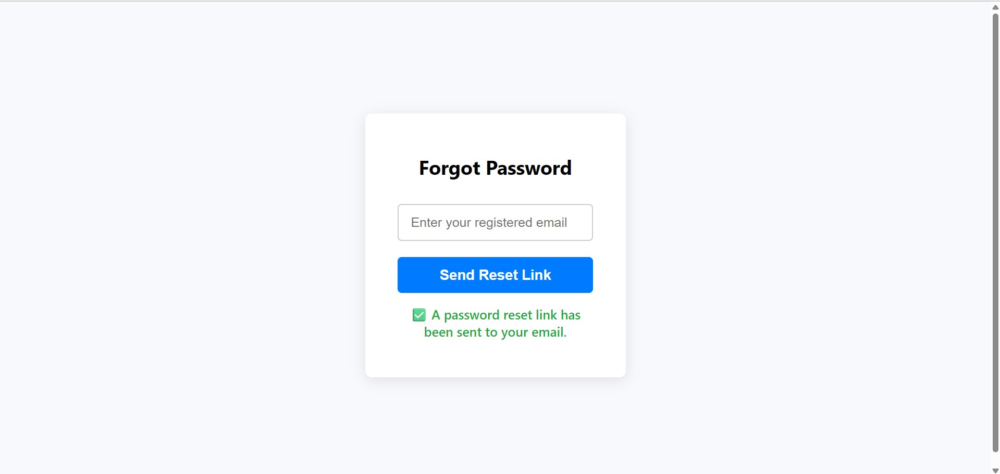
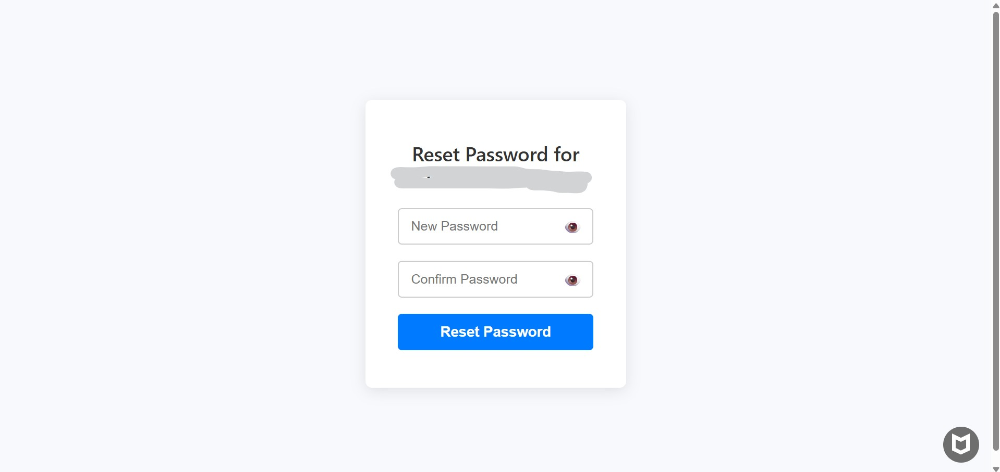

# Admin Login & SignUp Form (HTML + JAVASCRIPT + PHP + MySQL + OTP Verification + RESET PASSWORD VIA LINK )

A secure Html, Javascript And PHP-based Admin Login & SignUp system featuring OTP email verification, password reset via token/OTP, and session-based authentication.

---

## Features

- **Admin Signup** with email-based OTP verification (1-minute expiry).
- **Admin Login** with session protection.
- **Password Reset** via token & OTP.
- **Resend OTP** functionality with cooldown.
- **Secure Password Hashing** using PHP `password_hash()`.
- **PHPMailer** integration for sending OTPs & reset links.
- **Protected Admin Dashboard** accessible only after login.
- **Composer Dependency Management**.

---

## Project Structure
```bash
Admin_Login_SignUp_Form/
│
├── db.php                          # Database connection file
│
├── vendor/                         # Created by Composer (PHPMailer & dependencies)
│
├── composer.json                   # Composer dependencies list
├── composer.lock                   # Composer lock file
│
├── admin/                          # Protected admin area
│   ├── forgot_password.php         # Sends reset link or OTP for password reset
│   ├── home.php                    # Admin dashboard (requires login)
│   ├── index.php                   # Redirects to login
│   ├── login.php                   # Admin login page
│   ├── logout.php                  # Ends session and redirects to login
│   ├── resend_otp.php              # Generates & emails a fresh OTP (1 min expiry)
│   ├── reset_password.php          # Handles password update after reset
│   ├── signup.php                  # Sends OTP email (valid for 1 min) instead of direct DB insert
│   ├── verify_otp.php              # Handles OTP verification, live countdown, resend button
```
---

##  Installation & Setup

### Prerequisites
- Install **[XAMPP](https://www.apachefriends.org/index.html)** or any PHP + MySQL environment.
- PHP **7.4** or above.
- Install **Composer** (required for PHPMailer).

---

### Installing Composer

Composer is required to install PHPMailer and other dependencies.

1. Visit the official Composer download page:  
   [https://getcomposer.org/download/](https://getcomposer.org/download/)

2. **Windows Installation**  
   - Download `Composer-Setup.exe` from the above link.  
   - Run the installer and follow the instructions:  
   - Select your PHP executable (usually `C:\xampp\php\php.exe`).
   - Ensure “Add Composer to PATH” is checked.
   - Open your `php.ini` file (in `C:\xampp\php\php.ini`) and ensure the following extensions are enabled (remove the `;` at the start if present):
     ```
     extension=openssl
     extension=sockets
     extension=mbstring
     ```
     Save the file and restart Apache.

3. **Linux/macOS Installation**  
   - Open a terminal and run:
     ```bash
     php -r "copy('https://getcomposer.org/installer', 'composer-setup.php');"
     php composer-setup.php
     php -r "unlink('composer-setup.php');"
     sudo mv composer.phar /usr/local/bin/composer
     ```
   - Verify installation:
     ```bash
     composer --version
     ```

---

---

### Configure PHPMailer

PHPMailer is already included via Composer, but you must configure your email settings to send OTPs and password reset links.

1. **Open the PHPMailer Configuration File**  
   - Locate the file where PHPMailer is initialized (e.g., `send_otp.php` or a dedicated mail configuration file).

2. **Edit SMTP Settings**  
   Example (using Gmail SMTP):
   ```php
   use PHPMailer\PHPMailer\PHPMailer;
   use PHPMailer\PHPMailer\Exception;

   require 'vendor/autoload.php';

   $mail = new PHPMailer(true);

   try {
       // Server settings
       $mail->isSMTP();
       $mail->Host       = 'smtp.gmail.com';
       $mail->SMTPAuth   = true;
       $mail->Username   = 'your_email@gmail.com'; // Your Gmail address
       $mail->Password   = 'your_app_password';    // Your Gmail App Password
       $mail->SMTPSecure = PHPMailer::ENCRYPTION_STARTTLS;
       $mail->Port       = 587;

       // Recipients
       $mail->setFrom('your_email@gmail.com', 'Admin System');
       $mail->addAddress($recipientEmail);

       // Content
       $mail->isHTML(true);
       $mail->Subject = 'Your OTP Code';
       $mail->Body    = 'Your OTP is: <b>' . $otp . '</b>';

       $mail->send();
       echo 'OTP sent successfully';
   } catch (Exception $e) {
       echo "Message could not be sent. Mailer Error: {$mail->ErrorInfo}";
   }


###  Steps to Install Project

1. **Clone or Download the Repository**  
   - Using Git:  
     ```bash
     git clone https://github.com/tusharjambhule2005/Admin_Login_SignUp_Form.git
     cd Admin_Login_SignUp_Form
     ```
   - Or download the ZIP file and extract it into the `htdocs` folder of XAMPP.

2. **Install Composer Dependencies**  
   - Open the terminal/command prompt.  
   - Navigate to the project folder:  
     ```bash
     cd "path/to/Admin_Login_SignUp_Form"
     ```
   - Run:  
     ```bash
     composer install
     ```

3. **Create the Database**  
   - Start MySQL from XAMPP.  
   - Open **phpMyAdmin**: [http://localhost/phpmyadmin](http://localhost/phpmyadmin).  
   - Create a new database (example: `admin_system`).
     
4. Update Database Configuration
Open db.php and set your database credentials:
     ```bash
     $dbname = "admin_login_signup";
     ```
6. **Import the Database Schema ,Open **phpMyAdmin**: [http://localhost/phpmyadmin](http://localhost/phpmyadmin). **  
   ```sql
   CREATE TABLE admin (
       id INT AUTO_INCREMENT PRIMARY KEY,
       fullname VARCHAR(100) NOT NULL,
       email VARCHAR(255) NOT NULL UNIQUE,
       phone VARCHAR(20),
       password VARCHAR(255) NOT NULL,
       created_at TIMESTAMP DEFAULT CURRENT_TIMESTAMP
   );

   CREATE TABLE password_resets (
       id INT AUTO_INCREMENT PRIMARY KEY,
       admin_id INT NOT NULL,
       token VARCHAR(64) NOT NULL UNIQUE,
       expires_at DATETIME NOT NULL,
       used BOOLEAN DEFAULT FALSE,
       created_at TIMESTAMP DEFAULT CURRENT_TIMESTAMP,
       FOREIGN KEY (admin_id) REFERENCES admin(id)
   );

  ---
  
### Run the Project
- Start Apache & MySQL from XAMPP.
- Open your browser and go to:
- http://localhost/Admin_Login_SignUp_Form/admin/login.php
  
  ---
### Screenshots

## Login Page


## Signup Page


## Forget Password


## Verify OTP


## Forget password Link sent


## Reset Password

